# Architecture diagrams

Three figures, each making one claim. Source SVGs are hand-authored, theme-aware
(they follow `prefers-color-scheme`) and have no runtime or external assets.

## 1. The system

Capture → candidates → approval UI → judgement store → router → content-addressed
answers → surfaces → events → insights.

The claim: **there is no edge from captured material to an answer that does not pass
through a human.** A candidate is stored, shown to the creator in the review queue,
and excluded from every answer until someone promotes it.

## 2. The answer path

Nine pure stages inside a sealed boundary — no network, no model, no clock, no
randomness — ending in a ten-character content hash.

The claim: **the same question returns the same answer, every time.** That is what
makes a live demo safe, and it is asserted by test rather than asserted in prose.

Stages 8 and 9 are where the product refuses rather than guesses: a missing fact
produces one clarifying question from the creator's own notebook, and no template
ever prints an unfilled slot.

## 3. Where a model may run

Two lanes drawn to identical geometry so the only thing that moves is the difference.

The claim: **a model never writes an answer.** At most it proposes a structured
candidate from words the creator already said, offline, behind an optional key — and
any proposed unit whose quote is not literally present in the transcript is discarded
before a human ever sees it. Without the key, the heuristic extractor does the same
job, which is the path that runs by default.

## Regenerating

The SVGs are authored by hand and checked in. Edit them directly; there is no build
step and nothing generates them from the source.
